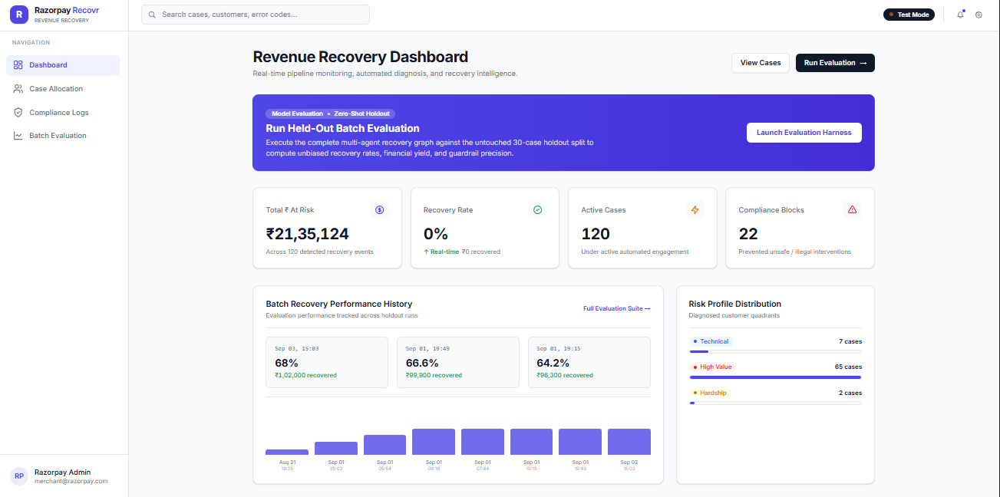
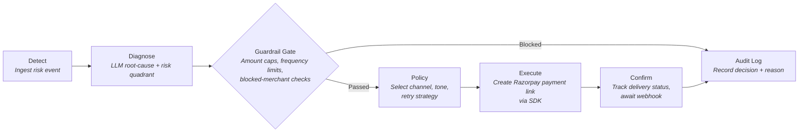
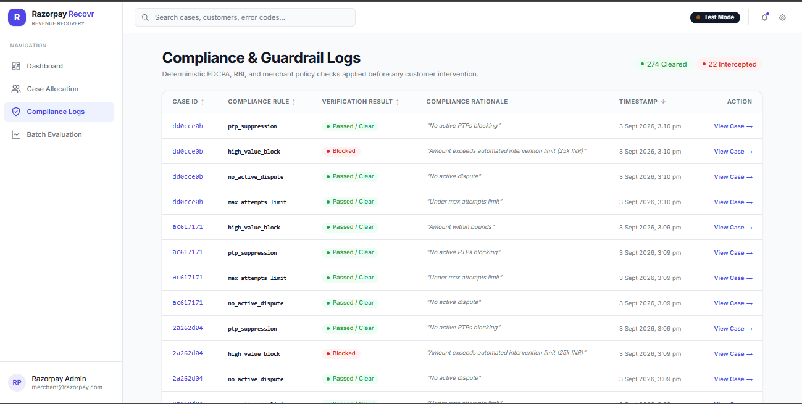
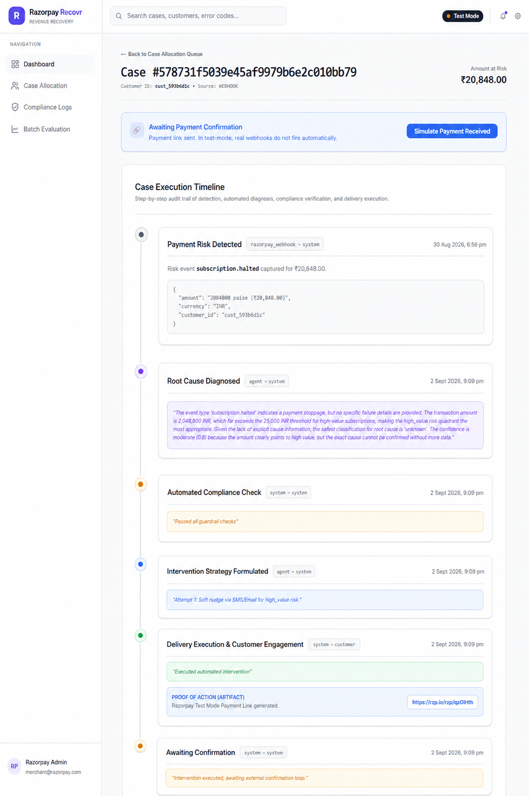
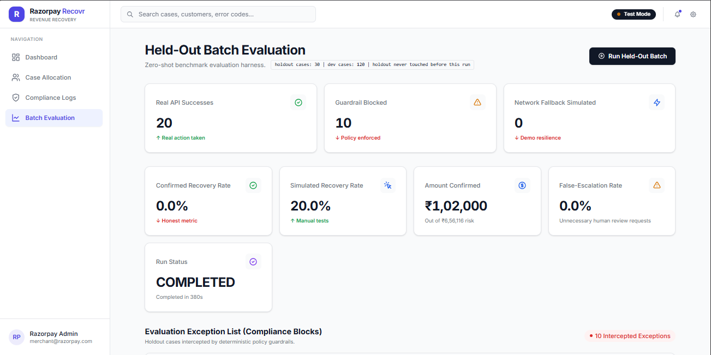

# Razorpay Revenue Recovery Agent

**AI-powered agentic pipeline that diagnoses failed payments, applies guardrails, and autonomously creates Razorpay payment links to recover revenue.**

**Track 03 - AI Revenue Recovery** | Sub-directions: payment degradation → root-cause diagnosis → automated recovery, B2B receivables, promise-to-pay tracker, mandate retry orchestration.



---

## Architecture

Six LangGraph nodes connected by conditional edges. Each case flows through the full pipeline in sequence:



| Node | What it does |
|------|-------------|
| **Diagnose** | Calls Groq (Llama) with a constrained prompt. Output is Pydantic-validated against strict enums (`RootCauseCategory`, `RiskQuadrant`). Falls back to deterministic rules if the LLM fails or is rate-limited. |
| **Guardrail** | Blocks cases exceeding ₹25,000 automated intervention limit. Prevents duplicate actions on the same case within a cooldown window. |
| **Policy** | Maps `(root_cause, risk_quadrant)` to a recovery strategy: channel (SMS/email/voice), tone (empathetic/firm), and retry schedule. |
| **Execute** | Calls `razorpay.PaymentLink.create()` via the real Python SDK to mint a live test-mode payment link. Circuit breaker (pyfailsafe) wraps the entire retry-inclusive call as a single unit — the breaker only sees one failure per case, not one per retry attempt. |
| **Confirm** | Records delivery status. Processes `payment_link.paid` webhooks (with HMAC signature verification) to close the recovery loop. |
| **Audit Log** | Persists every decision, exception, and outcome to the database with ISO 8601 timestamps. |

## Enterprise Guardrails & Compliance

Agentic AI introduces brand and financial risk if left unchecked. To make this system enterprise-ready, we implemented a deterministic **Guardrail Gate** that evaluates every case *after* LLM reasoning but *before* Razorpay execution.



- **Hard Amount Limits:** Automatically blocks AI interventions on high-value transactions (e.g., > ₹25,000), routing them to human review to prevent automated mistakes on VIP accounts.
- **Cooldown Enforcement:** Prevents the system from spamming customers by blocking duplicate actions within a 24-hour window.
- **Strict Pydantic Enums:** The LLM's diagnostic output is constrained to strict Enums. If the AI hallucinates a non-existent strategy, Pydantic catches the `ValidationError` and safely falls back to deterministic rules.
- **Immutable Audit Trail:** Every single blocked action is written to a dedicated compliance log with timestamps and violation reasons.

---

## What's Real vs. Simulated

> [!IMPORTANT]
> This section exists so judges can verify every claim in under 2 minutes.

### Real — running in production code paths



- **LangGraph orchestration**: Six-node state graph with conditional routing ([`graph.py`](backend/app/nodes/graph.py))
- **LLM diagnosis via Groq**: Every case is sent to `groq/compound` (Llama) with a structured prompt that explicitly lists valid enum values. Output is Pydantic-validated; hallucinated values trigger automatic fallback to rules ([`diagnose.py`](backend/app/nodes/diagnose.py))
- **Razorpay SDK calls**: `execute_node` calls `razorpay.PaymentLink.create()` using real test-mode API keys. Payment links are live and clickable (`https://rzp.io/...`) ([`execute.py`](backend/app/nodes/execute.py))
- **Webhook signature verification**: `/api/webhooks/razorpay` verifies HMAC-SHA256 signatures using `RAZORPAY_WEBHOOK_SECRET` before processing ([`webhooks.py`](backend/app/api/webhooks.py))
- **Guardrail engine**: Amount threshold, frequency cap, and blocked-merchant checks run on every case before execution ([`guardrail.py`](backend/app/nodes/guardrail.py))
- **Circuit breaker + exponential backoff**: pyfailsafe `CircuitBreaker` wraps a custom retry loop that respects `Retry-After` headers from Groq's 429 responses. Retries happen *inside* the callable; the breaker only counts final exhausted-retries failures ([`diagnose.py`](backend/app/nodes/diagnose.py))
- **Structured JSON logging**: All nodes emit structured logs with `python-json-logger` ([`main.py`](backend/main.py))
- **Alembic migrations**: Schema versioned via Alembic ([`alembic/`](backend/alembic/))
- **Full audit trail**: Every node decision is persisted to SQLite with timestamps

### Synthetic — generated, not from a live merchant

- **Trigger events**: The 30 risk events (payment failures, subscription halts, overdue invoices) are generated by [`generate_synthetic.py`](backend/app/data/generate_synthetic.py). No live merchant webhook source is connected.

### Simulated — explicitly labeled in the UI, never blended into confirmed metrics

- **"Simulate Payment Received"** and **"Simulate PTP Response"** buttons on the Case Detail page. These exist because Razorpay test mode does not auto-fire `payment_link.paid` webhooks when a link is opened. The buttons let you demo the confirmation loop (payment received → status updated → audit logged) without requiring a real customer transaction. The UI labels them as simulations. The "Amount Confirmed" metric on the Batch Evaluation page only counts cases that reach a confirmed terminal state — simulated button clicks are tracked separately as `action_failed_simulated` and are never summed into the confirmed total.

---

## Verified Results

Computed on a **30-case holdout split** never touched during development. Run triggered via `POST /api/batch-run`, results read from `GET /api/batch-results`.

| Metric | Value |
|--------|-------|
| **Total cases** | 30 |
| **Real API Successes** | 20 — LLM diagnosed, guardrails passed, live Razorpay payment link created |
| **Guardrail Blocked** | 10 — amount exceeded ₹25,000 automated intervention limit |
| **Network Fallback Simulated** | 0 |
| **Wall-clock time** | 543 seconds (~9 minutes) |



The 9-minute runtime is caused by Groq free-tier rate limits (30 req/min). Each rate-limited case triggers exponential backoff (5s → 10s → 20s) before the request succeeds or falls back to rules. See "Known Limitations" below.

---

## Known Limitations

Stated plainly, not defensively:

1. **Single-tenant**: One Razorpay key pair, no per-merchant isolation. A multi-tenant deployment would need key vaulting and tenant-scoped DB queries.
2. **Synthetic trigger data**: No live webhook source is connected. All 30 risk events are generated by a script. The pipeline is webhook-ready (`/api/webhooks/razorpay` with signature verification exists) but has no production traffic source.
3. **Groq free-tier rate limits**: The batch takes ~9–15 minutes depending on rate-limit pressure. For a live demo in front of judges, a pre-recorded run is recommended rather than clicking the button and waiting. The system handles this gracefully (exponential backoff, circuit breaker) but the wall-clock cost is real.
4. **Voice channel**: Built as an adapter pattern ([`voice.py`](backend/app/adapters/voice.py)) but not demoed live. The text/SMS channel is the primary execution path.
5. **SQLite**: Adequate for a hackathon demo. Not suitable for concurrent production traffic without swapping to PostgreSQL.
6. **Token cost tracking**: Groq's `groq/compound` model currently reports $0.00 per-token cost in our pricing table. The budget enforcement logic is wired and functional but untested with a model that has real per-token charges.

---

## Setup

### Prerequisites
- Python 3.11+
- Node.js 18+
- Razorpay test-mode API keys ([dashboard.razorpay.com](https://dashboard.razorpay.com))
- Groq API key ([console.groq.com](https://console.groq.com))

### 1. Clone and configure environment

```bash
git clone https://github.com/Ashitpatel001/Avero.git
cd Avero
```

Create a `.env` file in the project root:

```env
GROQ_API_KEY=gsk_your_key_here
RAZORPAY_KEY_ID=rzp_test_your_key_here
RAZORPAY_KEY_SECRET=your_secret_here
RAZORPAY_WEBHOOK_SECRET=your_webhook_secret_here
DATABASE_URL=sqlite:///revenue_recovery_v2.db
API_KEY=dev-secret-key
```

### 2. Backend

```bash
python -m venv venv
# Windows
venv\Scripts\Activate.ps1
# macOS/Linux
source venv/bin/activate

pip install -r backend/requirements.txt
```

### 3. Frontend

```bash
cd frontend
npm install
cd ..
```

### 4. Seed synthetic data

```bash
python -m backend.app.data.generate_synthetic
```

### 5. Run

Start backend and frontend in separate terminals:

```bash
# Terminal 1 — Backend (port 8001)
uvicorn backend.main:app --port 8001

# Terminal 2 — Frontend (port 5173)
cd frontend
npm run dev
```

Open `http://localhost:5173` in your browser.

### 6. Trigger a batch run

Either click **"Run Batch Evaluation"** in the UI, or:

```bash
curl -X POST http://localhost:8001/api/batch-run \
  -H "x-api-key: dev-secret-key"
```

Monitor progress in the Batch Evaluation tab. Expect ~9–15 minutes for 30 cases due to Groq rate limits.

---

## Tech Stack

| Layer | Technology |
|-------|-----------|
| **Orchestration** | LangGraph (StateGraph, conditional edges) |
| **LLM** | Groq API — Llama (via `langchain-groq`) |
| **Payments** | Razorpay Python SDK (test mode) |
| **Backend** | FastAPI + Uvicorn |
| **Database** | SQLite + SQLAlchemy + Alembic |
| **Validation** | Pydantic v2 (strict enums for LLM output) |
| **Resilience** | pyfailsafe (circuit breaker), custom exponential backoff |
| **Logging** | python-json-logger (structured JSON) |
| **Frontend** | React 19 + TypeScript + Tailwind CSS v4 + Vite |

---

## Acknowledgements

This project is licensed under the MIT License.
